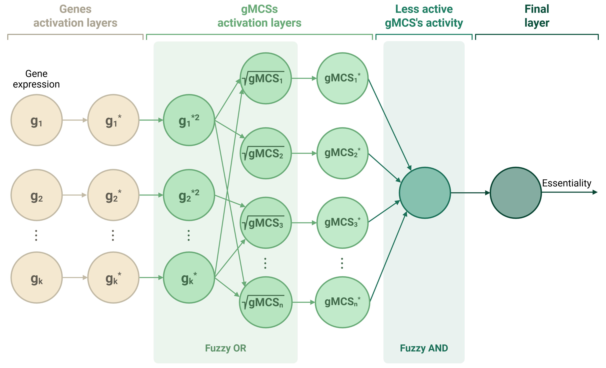

<!-- PROJECT INTRODUCTION -->
<a id="top"></a>

<h1 align="center">gMCS-Net</h1>

<p align="center">
  An interpretable fuzzy neural network to predict context-specific essential genes
  <br />
  <a href="https://github.com/ljareno/gMCS-Net/issues">Request Feature</a>
  <br />
</p>


<!-- TABLE OF CONTENTS -->
<details>
  <summary>Table of Contents</summary>
  <ol>
    <li><a href="#about-the-project">About the Project</a></li>
    <li>
      <a href="#getting-started">Getting Started</a>
      <ul>
        <li><a href="#prerequisites">Prerequisites</a></li>
        <li><a href="#environment-setup">Environment setup</a></li>
      </ul>
    </li>
    <li>
      <a href="#training-and-testing">Training and testing gMCS-Net</a>
      <ul>
        <li><a href="#required-input-files">Required input files</a></li>
        <li>
          <a href="#training">Training</a>
          <ul>
            <li><a href="#output-file-names">Output file names</a></li>
            <li><a href="#training-parameters">Parameters for training</a></li>
            <li><a href="#run-training">Running the training code</a></li>
          </ul>
        </li>
        <li>
          <a href="#testing">Testing</a>
          <ul>
            <li><a href="#prediction-parameters">Parameters for predicting</a></li>
            <li><a href="#run-prediction">Running the prediction code</a></li>
          </ul>
        </li>
      </ul>
    </li>
    <li><a href="#slkb">Synthetic Lethality Knowledge Base (SLKB)</a></li>
    <li><a href="#contributing">Contributing</a></li>
    <li><a href="#contact">Contact</a></li>
    <li><a href="#acknowledgments">Acknowledgments</a></li>
  </ol>
</details>

---


<!-- ABOUT THE PROJECT -->

<a id="about-the-project"></a>

# About the Project

<p align="center"></p>

<p align="justify">
gMCS-Net is an interpretable fuzzy neural network that bridges mechanistic modeling and data-driven learning to identify metabolic vulnerabilities in cancer. Built upon the Genetic Minimal Cut Sets (gMCSs) framework, it employs fuzzy logic to represent continuous gene activity levels, overcoming the binary constraints of classical approaches. By integrating large-scale gene expression and CRISPR-Cas9 viability data, gMCS-Net captures complex nonlinear dependencies and reduces false positives caused by incomplete metabolic reconstructions. On unseen cancer cell lines, it achieved a PPV of 0.925, nearly doubling the performance of threshold-based mechanistic methods, while maintaining full biological interpretability. Combining predictive accuracy with mechanistic transparency, gMCS-Net provides a scalable and interpretable framework for uncovering cancer-specific metabolic vulnerabilities and guiding precision oncology strategies.
</p>

<p align="right">(<a href="#top">back to top</a>)</p>


<!-- GETTING STARTED -->

<a id="getting-started"></a>

# Getting Started


<!-- PREREQUISITES -->

<a id="prerequisites"></a>

## Prerequisites

gMCS-Net training/testing scripts require the following environment setup:

- Recommended hardware
  - GPU server with CUDA installed (can also run on non-CUDA devices)

- Software
  - Python = 3.9
  - Miniconda or Anaconda  
    - Installation guide: https://docs.conda.io/projects/conda/en/latest/user-guide/install/
  - Weights & Biases (only for training)  
    - Create a free account at https://wandb.ai/site


<!-- ENVIRONMENT SETUP -->

<a id="environment-setup"></a>

## Environment setup for training and testing gMCS-Net

**1.** Create an environment called `gMCS-Net` using `python=3.9`

```bash
conda create --prefix PATH_TO_SAVE_ENVIRONMENT/gMCS-Net python=3.9
```

**2.** Activate environment

```bash
conda activate PATH_TO_SAVE_ENVIRONMENT/gMCS-Net
```   

**3.** Install the cuda-toolkit (other versions= https://anaconda.org/nvidia/cuda-toolkit), don't necessarily choose the most recent version, make sure that it is a version compatible with PyTorch Sparse and Pytorch.

```bash
conda install -c "nvidia/label/cuda-11.8.0" cuda-toolkit 
```
  * Tip: to verify your CUDA version ```nvcc --version```

**4.** Install PyTorch and PyTorch Sparse in the created gMCS-Net environment

  * Depending on the **specifications of your machine and cuda-toolkit installed**, run appropriate command to install PyTorch.
  The installation command line can be found in https://pytorch.org/get-started/locally/ or https://pytorch.org/get-started/previous-versions/.

  For cuda 11.8 and linux/windows OS...
   ```bash
  pip install pytorch==2.1.0 torchvision==0.16.0 torchaudio==2.1.0 pytorch-cuda=11.8 -c pytorch -c nvidia
  ```

**5.** After installing PyTorch install <a href="https://pypi.org/project/torch-sparse/">PyTorch Sparse</a>, to install the binaries for PyTorch simply run (make sure you install it for the correct PyTorch version)...

  ```bash
  pip install torch-scatter torch-sparse -f https://data.pyg.org/whl/torch-2.1.0+cu118.html 
  ```

  For other versions...
  ```bash
  pip install torch-scatter torch-sparse -f https://data.pyg.org/whl/torch-${PYTORCH_VERSION}+${CUDA}.html and
  ```
  where ```${PYTORCH_VERSION}``` should be replaced by your version of PyTorch and ```${CUDA}``` should be replaced by ```cpu```, ```cu116```, ```cu117```, etc. depending on your PyTorch installation.

**6.** Also install the following packages...
  ```bash
  pip install numpy==1.26.0
  pip install pandas
  pip install scipy 
  pip install matplotlib 
  conda install anaconda::statsmodels
  pip install -U scikit-learn
  pip install seaborn
  pip install tqdm 
  pip install wandb
  ```

<p><b>After setting up the conda virtual environment, make sure to activate environment before executing gMCS-Net scripts.</b></p>

<p align="right">(<a href="#about-the-project">back to top</a>)</p>


<!-- TRAINING AND TESTING -->

<a id="training-and-testing"></a>

# Training and testing gMCS-Net

The files needed to train the models are at https://github.com/ljareno/gMCS-Net/data and https://github.com/ljareno/gMCS-Net/code/python


<!-- REQUIRED INPUT FILES -->

<a id="required-input-files"></a>

## Required input files

* **cell_index.txt**: Ordered list of cell line names (n = 1,103). This order matches the rows in CRISPR.txt and Expression.txt.
* **CRISPR.txt**: Matrix of essentiality/viability values from DepMap 24Q4: 1,103 cell lines × 386 genes.
    * Rows: cell lines (ordered as in cell_index.txt)
    * Columns: genes (ordered as in genes_index.txt)
    * Values: numerical essentiality scores
* **Expression.txt**: Matrix of gene expression values from DepMap 24Q4: 1,103 × 386.
    * Rows: cell lines (ordered as in cell_index.txt)
    * Columns: genes (ordered as in genes_index)
    * Values: normalized expression levels
* **fold_x_data_LELO.txt**: File containing all gene–cell line combinations, the corresponding label, and the data split (train / validation / test) for each fold.
* **genes_index.txt**: Table listing the 386 genes with their identifiers: ENSEMBL, SYMBOL, and ENTREZID. This order matches the order of genes in CRISPR.txt, Expression.txt, and gMCSs.
* **gMCSs.txt**: Binary matrix (2,983 gMCSs × 386 genes) where each row contains 0/1 values indicating whether each gene participates in the corresponding gMCS. Columns follow the same order as in genes_index.txt.

<p align="right">(<a href="#about-the-project">back to top</a>)</p>


<!-- TRAINING -->

<a id="training"></a>

## Training

The training script is: <a href="https://github.com/ljareno/gMCS-Net/code/python/train_wandb.py">code/python/train_wandb.py</a>. In section 1) Paths and data, you must adjust paths to your data location and the output directory where results will be saved.


<!-- OUTPUT FILE NAMES -->

<a id="output-file-names"></a>

### Output file names

In <a href="https://github.com/ljareno/gMCS-Net/code/python/neural_network.py">code/python/neural_network.py</a> you can modify the names used to save the model and plots:

* **Model name**: If in the fit function the parameter save_model = True, the trained model will be saved. The filename can be set around line 351.
* **Plots**: Training and validation plots are included. Filenames for the .png outputs can be set around lines 365 and 375. 


<!-- TRAINING PARAMETERS -->

<a id="training-parameters"></a>

### Parameters for training

In addition to the input files, the are some optional parameters that can be modified: 

  1. **epochs**: The number of epochs to run durind the training phase (type = int). 

  2. **batch_size**: The number of training examples in one forward/backward pass. The higher the batch size, the more memory space you'll need (type = int). 

  3. **learning_rate**: The learning rate. 

  4. **optimizer**: adam or sgd optimizer. 

  5. **decay_rate**: The learning rate decay. 

  6. **criterion**: MSE or MAE. 

  7. **momentum**: Momentum. 

  8. **w_genes**: Initial weight for the genes activation layer.

  9. **T**: Temperature parameter. 


<!-- RUN TRAINING -->

<a id="run-training"></a>

### Running the training code

**1.** Activate gMCS-Net environment

**2.** Login to wandb account

```bash
pip install wandb # If is not installed
wandb login APIKEY # APIKEY should be replaced by your API key.
```

**3.** In <a href="https://github.com/ljareno/gMCS-Net/code/python/train_wandb.py">code/python/train_wandb.py</a> change the entity parameter of the line 157 to your wandb username.

```bash
sweep_id = wandb.sweep(sweep_config, entity="YOUR_USERNAME", project=opt.project)
```

**4.** Choose whether training will run locally or on a cluster. 

  * Local: Run <a href="https://github.com/ljareno/gMCS-Net/code/python/train_wandb.py">code/python/train_wandb.py</a> directly. 
  * Cluster: (adapt these files to your cluster setup)

    1. Create the environment on the cluster.
    2. In <a href="https://github.com/ljareno/gMCS-Net/cluster/train.sh">cluster/train.sh</a> update folder paths and set your W&B API key.
    3. In <a href="https://github.com/ljareno/gMCS-Net/cluster/train_execute.sbs">cluster/train_execute.sbs</a> define required resources and update the conda environment path.
    4. Submit the job from the terminal with sbs train_execute.sbs (run it from the folder containing that file).


<!-- TESTING -->

<a id="testing"></a>

## Testing

The testing script is: <a href="https://github.com/ljareno/gMCS-Net/code/python/test_LELO.py">code/python/test_LELO.py</a>. In section 1) Paths and data, adjust paths to your data location and the output directory where results will be saved. This workflow uses a pre-trained model to generate predictions.


<!-- PREDICTION PARAMETERS -->

<a id="prediction-parameters"></a>

### Parameters for predicting

There are a few optional parameters that you can provide in addition to the input files:

  1. **criterion**: MSE o MAE. 
  2. **batch_size**: The number of training examples in one forward/backward pass. The higher the batch size, the more memory space you'll need (type=int).


<!-- RUN PREDICTION -->

<a id="run-prediction"></a>

### Running the prediction code

**1.** Activate SparseGO environment

**2.** Choose whether predictions will run locally or on a cluster.

  * Local: Run <a href="https://github.com/ljareno/gMCS-Net/code/python/test_LELO.py">code/python/test_LELO.py</a> directly. 
  * Cluster: (adapt these files to your cluster setup)

    1. In <a href="https://github.com/ljareno/gMCS-Net/cluster/test.sh">cluster/test.sh</a> update paths. 
    2. In <a href="https://github.com/ljareno/gMCS-Net/cluster/test_execute.sbs">cluster/test_execute.sbs</a> define required resources and update the conda environment path.
    3. Submit the job from the terminal with sbs test_execute.sbs (run it from the folder containing that file).

<p align="right">(<a href="#about-the-project">back to top</a>)</p>


<!-- SLKB -->

<a id="slkb"></a>

# Synthetic Lethality Knowledge Base (SLKB)

To predict double knockouts, follow the same steps as single-knockout training/testing, but using:
* <a href="https://github.com/ljareno/gMCS-Net/code/python/train_wandb_SLKB.py">code/python/train_wandb_SLKB.py</a> 
* <a href="https://github.com/ljareno/gMCS-Net/code/python/predict_SLKB.py">code/python/predict_SLKB.py</a>


### Output file names

In <a href="https://github.com/ljareno/gMCS-Net/code/python/neural_network_SLKB.py">code/python/neural_network_SLKB.py</a> you can modify the names used to save the model and plots:

* **Model name**: If in the fit function save_model = True, the trained model will be saved. The filename can be set around line 297.

* **Plots**: Plot output filenames can be set around line 311.

<p align="right">(<a href="#about-the-project">back to top</a>)</p>


<!-- CONTRIBUTING -->

<a id="contributing"></a>

# Contributing

Any contributions you make are **greatly appreciated**.

If you have a suggestion that would make this better, please fork the repo and create a pull request. You can also simply open an <a href="https://github.com/ljareno/gMCS-Net/issues">issue</a> with the tag "enhancement".

1. Fork the Project
2. Create your Feature Branch (`git checkout -b feature/AmazingFeature`)
3. Commit your Changes (`git commit -m 'Add some AmazingFeature'`)
4. Push to the Branch (`git push origin feature/AmazingFeature`)
5. Open a Pull Request


<!-- CONTACT -->

<a id="contact"></a>

# Contact

Laura Jareño - ljareno@unav.es


<!-- ACKNOWLEDGMENTS -->

# Acknowledgments
* <a href="https://www.wandb.ai/">Weights & Biases</a>
* <a href="https://github.com/hyeon95y/SparseLinear">Sparse Linear</a>
* <a href="https://depmap.org/portal/">DepMap</a>
* <a href="https://github.com/lvalcarcel/gmctool">gmctool</a>
* <a href="https://slkb.osubmi.org/">Synthetic Lethality Knowledge Base (SLKB)</a>


<p align="right">(<a href="#about-the-project">back to top</a>)</p>

